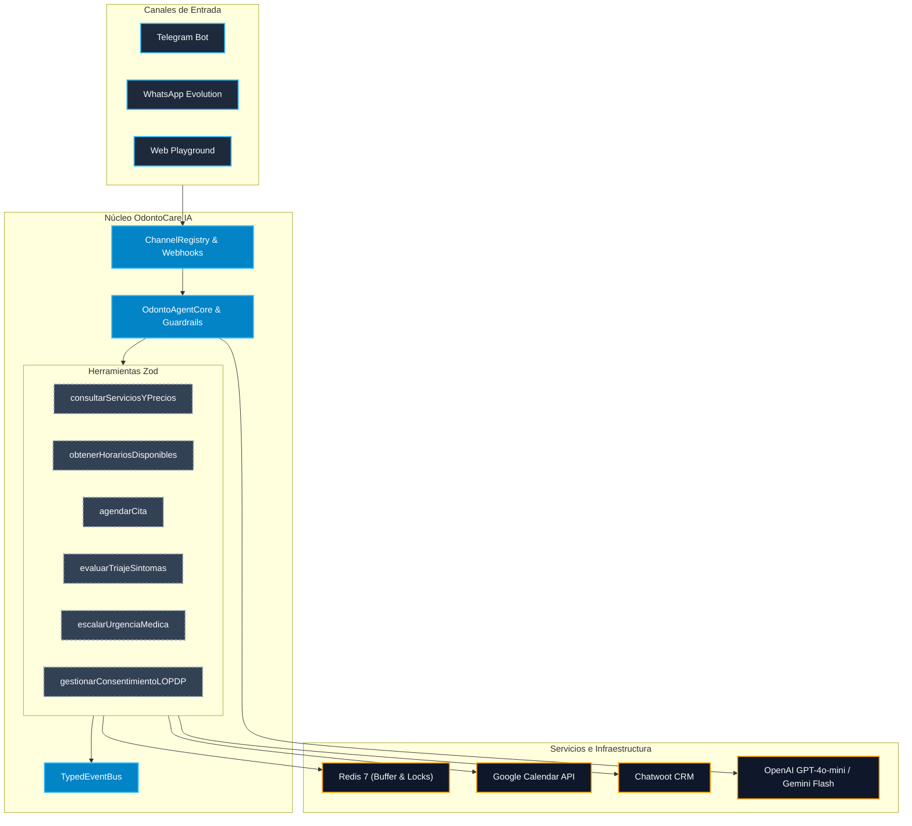

# 🦷 OdontoCare IA — Documentación Maestra, Metodología y Registro de Progreso (Edición 2026)

Este documento constituye la memoria técnica, guía metodológica y bitácora de arquitectura del proyecto **OdontoCare IA**, desarrollado para clínicas dentales con altos estándares de cumplimiento médico, legal y tecnológico.

---

## 📌 1. Resumen y Estado del Proyecto

**OdontoCare IA** es un ecosistema conversacional odontológico desacoplado, autónomo y multicanal, diseñado para la recepción, triaje de urgencias y agendamiento dinámico de citas para la clínica dental piloto en **Cuenca, Ecuador**.

### Canales y Conectores Activos:
1. **Playground Web Interactivo (`/chat`)**: Consola gráfica para pruebas locales y demostraciones en tiempo real (`http://localhost:3000/chat`).
2. **Endpoint REST Debugging (`POST /api/chat`)**: API JSON directa para pruebas automatizadas o integración con frontends externos.
3. **Telegram Bot Oficial**: `@odonto_agent_bot` (con soporte para texto y notas de voz transcritas con AssemblyAI).
4. **WhatsApp Evolution API / Meta Cloud API**: Conector webhook para números de teléfono y WhatsApp Business.
5. **Chatwoot CRM (Human Handoff)**: Bandeja de entrada compartida para recepción humana con pausa/reanudación bidireccional del bot.
6. **Google Calendar API v3**: Sincronización de agendas por especialista con prevención de colisiones.

---

## 🔬 2. Metodología de Evaluación y Auditoría de Código

Para garantizar la calidad de nivel hospitalario y cumplimiento regulatorio estricto, el desarrollo se rigió por una **Metodología de Auditoría Secuencial Especializada**:

```
[Auditor Legal & ISO 2026] ──> [Remediación Inmediata]
               │
               ▼
[Arquitecto de Software]   ──> [Desacoplamiento & Mermaid]
               │
               ▼
[Senior Bot Engineer]      ──> [Maximizador de Tooling SOTA]
               │
               ▼
[Batería de Pruebas de Personalidades & Verificación de Tests]
```

### 2.1 Marco Normativo de Referencia (Normas 2026)
1. **ISO/IEC 42001:2023/2026 (Artificial Intelligence Management System - AIMS)**:
   - *Cláusula 8.4 y Control A.7.2 (Transparencia)*: El sistema declara explícitamente ser una Inteligencia Artificial (`Valeria`). Prohibición absoluta de simulación antropomórfica engañosa (*deceptive anthropomorphism*).
   - *Límites Bioéticos*: No emite diagnósticos médicos definitivos; actúa exclusivamente como triaje orientativo y coordinador administrativo.
2. **Ley Orgánica de Protección de Datos Personales de Ecuador (LOPDP 2021/2026)**:
   - *Art. 25 y 26 (Datos Sensibles de Salud)*: Requiere consentimiento expreso e informado antes del tratamiento de motivos de consulta dental.
   - *Art. 21 (Derecho a la Eliminación / Olvido)*: Endpoint y comando dedicado para suprimir el historial clínico en disco, Redis y citas en 1 milisegundo.
   - *Art. 10 (Minimización)*: Solo se capturan los datos indispensables para la cita (nombre, teléfono y molestia).
3. **ISO/IEC 27001:2022/2026 & ISO 27799 (Seguridad de la Información en Salud)**:
   - *Control A.8.24 (Criptografía)*: Cifrado simétrico **AES-256-GCM** en reposo para sesiones locales (`SessionCryptoService`).
   - *Control A.8.15 (Logging Seguro)*: Enmascaramiento automático de números telefónicos (`099****123`), cédulas y correos mediante `SecureLogger`.
   - *Control A.8.26 (Seguridad en Aplicaciones)*: Validación criptográfica `crypto.timingSafeEqual` en cabeceras de webhooks.

---

## 🏛️ 3. Metodología de Arquitectura e Infraestructura Desacoplada

El sistema adopta los principios de **Arquitectura Hexagonal (Ports & Adapters)** y diseño orientado a eventos (Event-Driven):

### 3.1 Puertos y Adaptadores
- **Inbound Adapters**: `TelegramChannel`, `WhatsAppChannel` y `ExpressChatRouter` procesan las peticiones entrantes y las normalizan a un contexto unificado.
- **Outbound Adapters**: `ChannelRegistry` registra polimórficamente cada canal disponible. Para enviar recordatorios o alertas, el servicio invoca `channelRegistry.dispatchMessage(channel, to, text)` sin acoplarse al protocolo subyacente.
- **Event Bus Interno (`TypedEventBus`)**:
  - `appointment:booked`: Disparado cuando una cita se confirma; auto-registra recordatorios de asistencia.
  - `handoff:emergency`: Notifica a recepción y crea tickets urgentes en Chatwoot.
  - `privacy:erasure_requested`: Limpia buffers y estados ante solicitudes de supresión de datos.

### 3.2 Resiliencia y Circuit Breakers
- **Prevención de "Citas Fantasma"**: `calendarService` verifica la respuesta de Google Calendar. Si la API externa falla (error 503 o cuota agotada), devuelve `{ success: false }` de forma transparente, impidiendo prometer citas inexistentes al paciente.
- **Buffer Anti-Ráfagas**: Los mensajes se encolan con un debounce de 5 segundos en Redis (`pushToBuffer` / `flushBuffer`). Si Redis está apagado, conmuta automáticamente al almacén en memoria sin interrumpir el servicio.
- **Cascada de Modelos de IA**: Modelo Primario disciplinado (`openai/gpt-4o-mini`) con conmutación automática en caso de error 429 o fallo a `google/gemini-2.5-flash`.

---

## 🧠 4. Metodología de Prompting Clínico y Tooling (SOTA 2026)

### 4.1 Patrón Tool-Augmented Agent (Cero Alucinaciones)
Para evitar que el modelo invente precios o invente disponibilidad médica, se implementó el **Patrón de Herramientas Obligatorias**:

| Herramienta | Función Crítica | Datos de Grounding |
| :--- | :--- | :--- |
| `consultarServiciosYPrecios` | Devuelve tarifas oficiales y tratamientos | `clinic.config.json` |
| `obtenerHorariosDisponibles` | Calcula turnos libres reales por doctor | Google Calendar + Disponibilidad |
| `agendarCita` | Bloqueo atómico con Redis y confirmación | Redis Lock + Calendar + EventBus |
| `obtenerPerfilDoctor` | Credenciales, especialidad y días de trabajo | Ficha médica de doctores |
| `evaluarTriajeSintomas` | Escala dolor 1-10, banderas rojas y primeros auxilios | Algoritmo de triaje clínico |
| `escalarUrgenciaMedica` | Alerta inmediata 24/7 y pausa de bot | Chatwoot + Línea telefónica |
| `gestionarConsentimientoLOPDP` | Registro y revocación de consentimiento | `PrivacyService` |

### 4.2 Reglas de Humanización Conversacional
1. **Prohibición Total de Markdown en Mensajería**:
   - Cero asteriscos dobles (`**negrita**`), cero encabezados (`###`), cero viñetas con guiones (`-`).
   - Los mensajes a pacientes deben lucir como textos naturales escritos por una persona desde su teléfono celular.
2. **Regla Móvil de 2 a 3 Oraciones**:
   - Cada turno conversacional se limita a un máximo de 2 a 3 oraciones concisas para lectura rápida en WhatsApp.
3. **Condicionamiento de Voz para AssemblyAI**:
   - Reparación semántica de vacilaciones y muletillas de notas de voz (*"ehh"*, *"este"*, *"o sea"*, *"bueno"*).
   - Comprensión nativa de modismos de Cuenca (*"veci"*, *"chuta"*, *"full"*, *"calza"*, *"cordales"*, *"frenillos"*).
4. **Espejo Lingüístico Bilingüe (Expats en Cuenca)**:
   - Detección automática del idioma de entrada: Si el paciente escribe en inglés, Valeria responde 100% en inglés con fluidez y calidez.
5. **Guardrails Deterministas Anti-Fármacos**:
   - Filtro previo y posterior que bloquea cualquier recomendación o dosificación de medicamentos (*amoxicilina, ibuprofeno, buprex, etc.*), orientando al paciente a consulta presencial con compresa fría externa preventiva.

---

## 📊 5. Diagramas del Sistema

### 5.1 Diagrama de Arquitectura de Contenedores y Flujo de Datos


---

## 🛠️ 6. Guía de Comandos y Operaciones

```bash
# Instalar dependencias exclusivamente con pnpm
pnpm install

# Iniciar servidor en desarrollo con hot-reload (tsx watch)
pnpm run dev

# Ejecutar suite completa de tests unitarios (Vitest)
pnpm test

# Compilar TypeScript a producción (dist/)
pnpm run build

# Iniciar suite de pruebas de personalidades en vivo
pnpm exec tsx scripts/test-personas.ts

# Iniciar infraestructura contenerizada (Redis + Evolution API + OdontoCare)
docker compose up -d
```

---

## 📈 7. Registro de Versiones y Cambios Clave

- **v1.0.0 (Base)**: Creación inicial del agente con Vercel AI SDK Core, AssemblyAI y Telegraf.
- **v1.1.0 (Desacoplamiento)**: Integración de Redis buffer anti-ráfagas, Chatwoot human handoff y Evolution API WhatsApp.
- **v1.2.0 (Playground)**: Adición de endpoints `POST /api/chat` y `GET /chat` con UI interactiva para pruebas directas.
- **v2.0.0 (SOTA 2026)**:
  - Certificación y remediación ISO/IEC 42001:2026 y LOPDP Ecuador.
  - Cifrado en reposo AES-256-GCM para sesiones clínicas.
  - Guardrails deterministas anti-fármacos y anti-jailbreak.
  - Arquitectura Hexagonal con `ChannelRegistry`, `TypedEventBus` y `CircuitBreaker`.
  - Maximizador de 7 herramientas tipadas con Zod.
  - Acondicionamiento de voz AssemblyAI con modismos cuencanos y regla de 2 a 3 oraciones.
- **v2.1.0 (Dashboards Multi-Tenant & PostgreSQL)**:
  - Migración completa desde `clinics.json` a base de datos relacional PostgreSQL (`odontocare_db`).
  - Implementación de roles con JWT Claims (`SUPER_ADMIN`, `CLINIC_ADMIN`, `DOCTOR`) y seguridad RLS por clínica.
  - Nuevo diseño de Torre de Control (Beige Design System) con directriz de responsabilidad única por vista.
  - Construcción de módulos: Dashboard SaaS (Súper Admin), Dashboard Operativo y Directorio (Clínica), y Agenda/Odontograma (Doctor).
  - Integración de gráficos ApexCharts y endpoint de Impersonation.
  - Pruebas UI/UX pasadas exitosamente con Playwright CLI.
