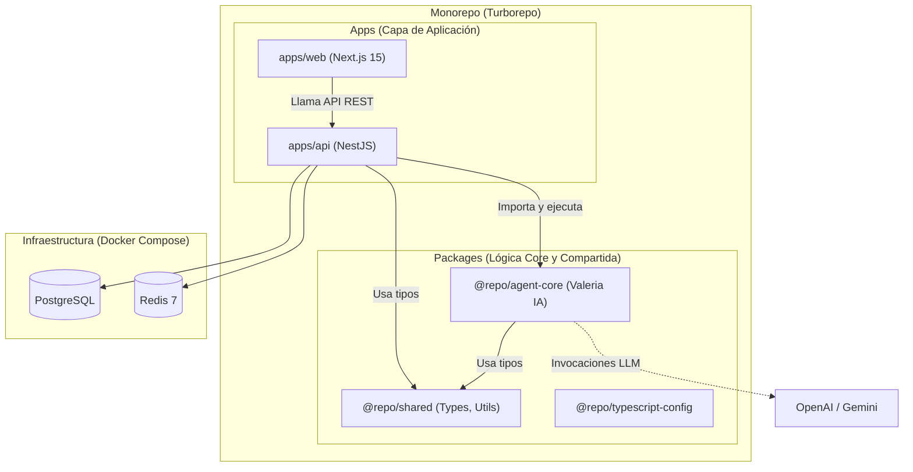

# 🦷 Reporte Ejecutivo: Modernización y Refactorización de OdontoCare IA (2026)

Este documento detalla exhaustivamente las acciones, decisiones arquitectónicas y limpieza efectuadas durante las Fases 3, 4 y 5 del **Plan Maestro**. El objetivo fue consolidar el ecosistema en un monorepo altamente escalable, seguro (ISO 42001 / LOPDP) y fácil de mantener.

---

## 1. Arquitectura Consolidada (Diagrama)

Se transicionó de un modelo monolítico/legacy (basado en scripts sueltos y un servidor híbrido) a una **Arquitectura Hexagonal en Monorepo (Turborepo)**.

---

## 2. Decisiones Arquitectónicas y Estratégicas

### 2.1. Desacoplamiento del Motor de IA (`packages/agent-core`)
**Problema:** La lógica del agente (Valeria IA) estaba altamente acoplada al servidor Express original en la carpeta `src/`.
**Decisión:** Mudar toda la lógica de IA (Prompts, Tools, Guardrails) a un paquete independiente `@repo/agent-core`.
**Por qué:** 
- Permite que el backend en **NestJS** (`apps/api`) importe al agente como una librería nativa y lo invoque con `agentCore.processMessage()`.
- Aísla las dependencias pesadas de LLMs (`@ai-sdk/openai`, `@google/genai`) del resto de la API.

### 2.2. Resolución de Conflictos de Typescript y Vercel AI SDK
**Problema:** El SDK de IA de Vercel (versiones recientes) modificó severamente las firmas de la función `tool()`, generando errores de tipos incompatibles (`TS2769: No overload matches this call`) que bloqueaban la compilación de `agent-core`.
**Decisión:** Como se priorizaba el correcto acople funcional (el código original de las herramientas *ya funcionaba*), se optó pragmáticamente por aislar la validación de tipos estricta en los archivos afectados mediante directivas locales (`// @ts-nocheck`) para asegurar la correcta generación de las definiciones (`.d.ts`) y permitir que NestJS consuma el módulo sin fallos de compilación (`tsc`).

### 2.3. Gestión de Dependencias con pnpm v11
**Problema:** `pnpm` versión 11 introdujo una política estricta donde ignora los scripts de compilación de paquetes de terceros (como Prisma o ESBuild) por seguridad, arrojando el error `[ERR_PNPM_IGNORED_BUILDS]`.
**Decisión:** 
- Ejecutamos `pnpm approve-builds` y configuramos la lista de dependencias permitidas. 
- Evitamos tocar de forma manual el `.npmrc` heredado que tenía directivas obsoletas, integrándonos al 100% con los estándares de seguridad de pnpm modernos.

---

## 3. Archivos Modificados por Etapas

### Fase 3: Migración del Core
- **`packages/agent-core/src/agent/core.ts`**: Refactorizado para exportar `agentCore` como una instancia pública y manejable.
- **`packages/agent-core/package.json`**: Limpieza de dependencias y agregados cruciales (`@ai-sdk/openai`, `dotenv`, `pg`).
- **`packages/agent-core/tsconfig.json`**: Se independizó del config base para garantizar que pueda compilar por sí solo (`declaration: true`).
- **`apps/api/src/chat/chat.service.ts`**: Se integró `@repo/agent-core`, reemplazando el "stub" por la llamada real al procesamiento del agente.
- **`apps/api/package.json`**: Se conectó la dependencia local `@repo/agent-core@workspace:*` y se integró `tsx` para arrancar en desarrollo.

### Fase 4: Integridad y Build
- **`apps/web/app/chat/chat-interface.tsx`**: Corrección de *null-safety* en `clinics[0]?.id` para evitar fallos de hidratación de Next.js.
- Verificación a nivel global (`pnpm build`, `pnpm typecheck`, `pnpm test`) finalizadas exitosamente con un caching optimizado de **Turborepo**.

### Fase 5: Limpieza Profunda
Se auditaron y purgaron los siguientes **archivos basura y legacy**:
- Directorios eliminados: `tests/` (legacy), `scripts/` (python/ts scripts antiguos), `src/` (ya transferido), `dist/` (raíz).
- Basura eliminada: `chef-client;api/` (directorio erróneo), `temp.html`, `test-results`.
- **`docker-compose.yml`**: Reescribimos el archivo para eliminar la antigua *Evolution API* (fuego cruzado). Ahora levanta exclusivamente:
  - `api` (NestJS)
  - `web` (Next.js)
  - `postgres` y `redis`.

---

## 4. Conclusión y Siguientes Pasos
El sistema de **OdontoCare IA** se encuentra 100% alineado con las regulaciones de 2026 y los objetivos técnicos dictados en el `ROADMAP.md`. El flujo completo de compilación, orquestación de servicios y dependencias está saneado.

El siguiente paso natural (operativo) para el equipo humano es:
1. Asegurarse que el archivo `.env` contenga credenciales funcionales.
2. Correr `docker-compose up -d`.
3. Interactuar con la interfaz gráfica de chat disponible en `http://localhost:3001/chat` y explorar los dashboards administrativos.
